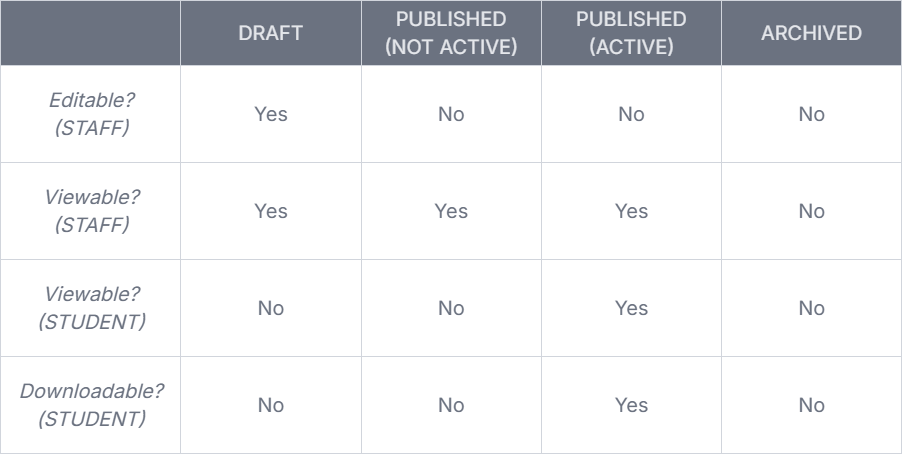
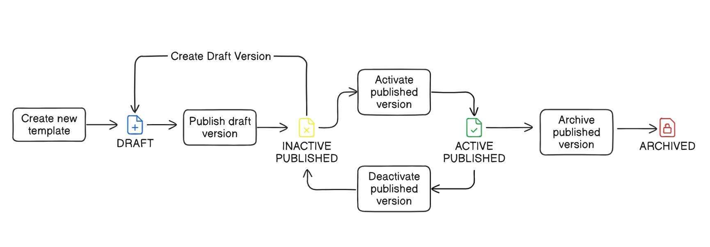

<h1 align="center">
Template Management Extension
</h1>

## About

This extension allows administrative users to create and maintain templates for the purposes of generating status letters, i.e., Bank or Council Tax Status Letters.
The templates are created using the Ellucian [Rich Text Editor](https://path-designsystem.elluciancloud.com/#/components/RichTextEditor) component which allows functional staff to create templates in whichever style they choose. The [custom-table-configurations](https://resources.elluciancloud.com/bundle/banner_exten_acn_use/page/c_create_custom_table_api.html) api is used to create tables in which to store the custom templates.

Once activated, students may download their personalised letter in PDF format using the student-side card.

This extension consists of two cards:

[x] **Template Management Card**: This card allows administrative users to create, edit, and manage document templates.

[x] **Letter Download Card**: This card enables students to generate and download letters based on the templates managed in the Template Management Card. It generates letters in PDF format.

## Template Lifecycle
A template can be in one of four distinct stages, which each have their own distinct properties.

## Template Version Rules
### Draft
* Only one draft is allowed per template.
* Draft versions may not be activated.
* Draft versions are editable and may be published or deleted.

### Published
* Multiple published versions are allowed per template.
* Published versions may be activated or inactivated.
* Only one published version per template can be considered active at any given time.
* Published versions are not editable and may only be archived.
* A new draft may be created from any published version.

### Archived
* Only published versions may be archived.
* Archived versions are inactive and invisible; they exist only as a historical artefact.

#### Lifecycle Diagram

---

## Prerequisites

Setting up this extension requires:
* Ability to make REST API calls using Postman or a similar tool.
* Familiarity with Ellucian Ethos Integration and Ellucian Experience.
* Familiarity with Data Connect and the Experience SDK.
* Administrative access to Ethos Integration and Banner Access Management, including the ability to modify permissions in Banner Security Maintenance.

## Set Up

Setting up this extension involves several steps:
1. **Create Custom Tables Using Postman or similar tool**
2. **Import Data Connect Serverless API Pipelines**
3. **Install packages and upload extension**

### 1. Create Custom Tables
Follow the steps in [custom-table-extensions/readme](docs/custom-table-extensions/readme.md)

### 2. Import Data Connect pipelines
Follow the steps in [data-connect/readme](data-connect/readme.md)

### 3. Install packages and upload extension
Follow the steps in [extension/readme](extension/readme.md)

##### Acknowledgements
Diagrams created using [eraser](https://app.eraser.io/)
Tables created using [table-generator](https://table-generator.de/)