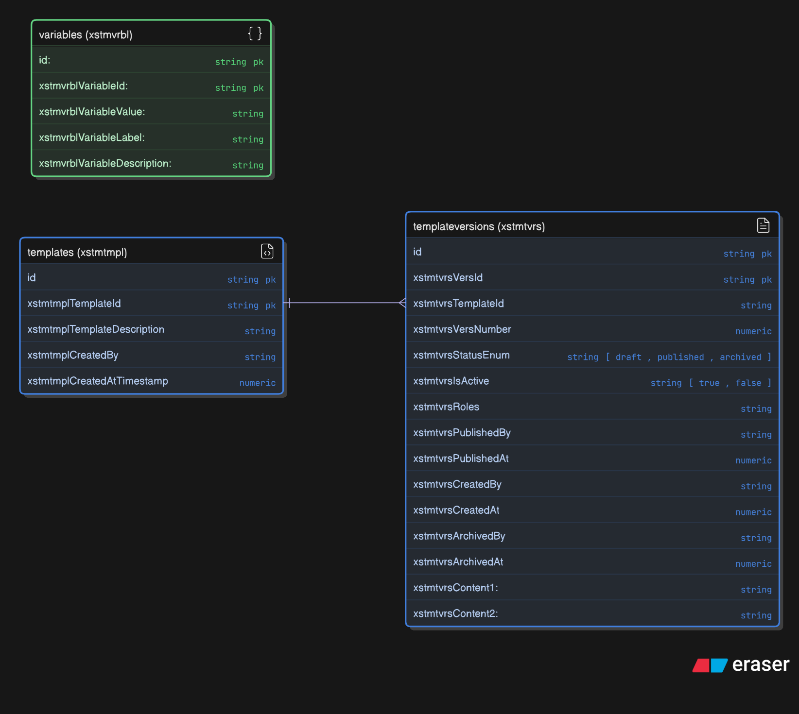
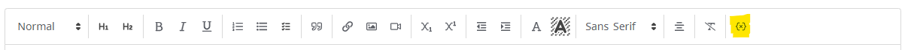

# Custom Tables

## About



These JSON files are used to define custom tables in the Staff Template Management extension. They should be POSTed to the custom-table-configurations endpoint.

There are three custom tables associated with this extension and are named according to the [naming conventions](https://resources.elluciancloud.com/bundle/banner_exten_acn_use/page/c_custom_table_api_name_conventn.html) defined by Ellucian:

All the tables start XSTM for Template Management and the following four letters denote their use.

1. **Templates** *XSTMTMPL* - stores the basic template data created in the extension
2. **Templates Versions** *XSTMTVRS* - stores the versions of each template, including the HTML content
3. **Variables** *XSTMVRBL* - stores the variables that can be used in the templates

* Templates has a one-to-many relationship with Templates Versions through the respective table's {tableName}TemplateId.  
* The Variables table is a stand-alone reference table that must be populated by a developer.

> **_GOTCHA:_**  You may be wondering why there is a primary key of id and a primary key of e.g., xstmtmplTemplateId. This is because when we create a custom table the custom-table-configurations API requires us to define a primary key.  
Despite this, the custom-table-configurations endpoint will automatically create an id field of type UUID as the primary key. This is the field that must be used for PUT and DELETE operations. Our primary key (e.g., xstmtmplTemplateId) will be used to define relationships between tables.

## Process

### Create a Custom Table Configuration

[Official documentation](https://resources.elluciancloud.com/bundle/banner_exten_acn_use/page/t_create_custom_table_api.html)

1. Send a POST request to the custom-table-configurations endpoint with the JSON file. This example will create the Templates custom table.
2. Note the response id as this may be useful later:

```json
{
  "customTableDescription": "Templates",
  "customTableName": "XSTMTMPL",
  "customTableSecurityObject": "API_X_XSTMTMPL",
  "id": "86feec6d-1795-45d5-ad4f-08c9fdd6e8b3"
}
```

- This id can be called to read the custom table configuration from custom-table-configurations/{id}

### Read Data from Custom Table

##### Add Resource in Ethos Integration

- Visit your instance of Ethos Integration `https://integrate.elluciancloud.ie/`
- Navigate to the application that will own this resource (for example, Integration API)
- Click on 'Owned Resources' tab
- Click on 'Add Resources' button
- Select 'Add a Custom Resource' and hit next
- Paste your api name (`x-xstmtmpl`) into the Resource Name field

##### Assign Permission to your APIUSER

- Visit Banner Access Management
- Navigate to Banner Security Maintenance
- For APIUSER User ID, click 'Modify' under Permissions.
- Use Insert to add a new permission and in the object name column, paste your `customTableSecurityObject` value (`API_X_XSTMTMPL`)
- Click 'Save' to save the new permission.

##### Read using the API endpoint

- Send a GET request to the custom table endpoint:
  `https://integrate.elluciancloud.ie/api/x-xstmtmpl`

  The response will contain the data from the custom table in JSON format! Since it hasn't been populated yet, we will expect an empty array:

```json
[]
```

### Populate the Custom Tables using the API endpoint

- Send a POST request to the custom table endpoint:
  `https://integrate.elluciancloud.ie/api/x-xstmtmpl`

  The request body should contain the data you want to insert into the custom table. The keys will be in camelCase. For example:

```json
{
  "id": "00000000-0000-0000-0000-000000000000",
  "xstmtmplId": "53a09361-cbce-4ad7-b9fe-772bd51a4fca", // Generate a new UUID for this field
  "xstmtmplTitle": "My First Template!",
  "xstmtmplDescription": "This is a generic description.",
  "xstmtmplCreatedAtTimestamp": 1753965191688, // Generate a new timestamp for this field
  "xstmtmplCreatedBy": "a8063ccf-cd92-4a08-a592-d3cf0c6f9417" // Use the UUID of the user creating the record
}
```

The extension will use Data Connect serverless API pipelines to populate these tables so manual population is shown here for demonstration purposes only.

A similar process should be followed to create the other two custom tables.

### Populating Variables
Variables must be populated manually using the x-xstmvrbl endpoint. Example body:

``` json
{
    "id": "00000000-0000-0000-0000-000000000000",
    "xstmvrblVariableId": "53a09361-cbce-4ad7-b9fe-772bd51a4fca", // Generate a new UUID for this field
    "xstmvrblVariableValue": "DATE_OF_BIRTH",
    "xstmvrblVariableLabel": "Date of Birth",
    "xstmvrblVariableDescription": "The date on which a person was born on"
}
```
Creating a new record in this table will populate the variable dropdown in the toolbar:

 

Each variable must be populated by submitting a similar JSON body and then the logic to determine the variable should be included in both the CREATE-PREVIEW and DOWNLOAD-LETTER pipelines by adding to the master variable map object in the assign variables fitting. Any additional API calls should be performed before this fitting and their response object assigned to a new mesage.payload.__response for the map to read from.